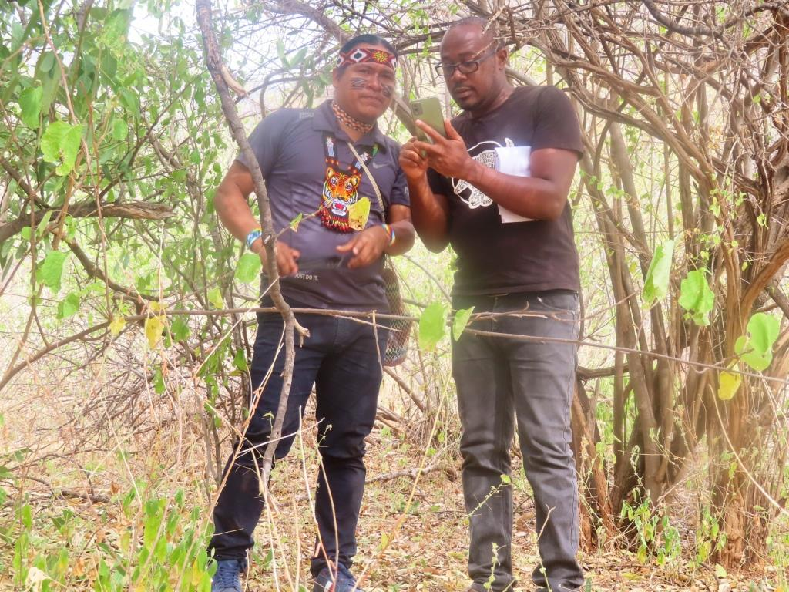

<!-- ✅ Navigation Menu -->

  <a href="/">Home</a>
  <a href="/about">About</a>

  
  <h2> About Me</h2>
  

    I'm <b>Douglas Mbura</b>, an <b>Environmental & Biosystems Engineer</b> and <b>GIS Specialiast</b> dedicated to advancing Indigenous-led AI, Water Engineering, and Environmental Innovation.
  

---

## 🎓 Education
- **MSc. Environmental Engineering** *(ongoing)* – University of Nairobi  
- **BSc. Environmental & Biosystems Engineering** – University of Nairobi  
- **Project Management Certification** – Kenya School of Government  

---

## 🏗️ Professional Focus
- Water Supply & Sanitation Infrastructure  
- GIS, Remote Sensing, and Mapping (With focus on Web GIS Technologies) 
- Bio-Acaustics, Machine Learning & AI for Conservation  
- Indigenous Data Governance    

---
## 🛠️ Projects
**💧 Nyamira County Water Infrastructure Projects
*🐾 Indigenous-Led Projects
- Ltome-Katip Project:Indigenous-led bioacoustics research analyzing elephant and rat communication patterns using AudioMoths and AI tools. 
*💼 Consultancy Work

---

## 💡 Side Venture — *Pollen Pulse Hives*
Founder of **Pollen Pulse Hives**, producing **100% pure natural honey** in Nyamira County, Kenya.  
📞 +254 100 306 491  
✉️ pollenpulsehives.pph@gmail.com  
🐦 [@PollenPulseHives](https://twitter.com/pollenpulsehives)

---

## 🌐 Connect With Me

  <a href="mailto:douglas.mbura@gmail.com" target="_blank"><i class="fa fa-envelope"></i></a>
  <a href="https://linkedin.com/in/douglas-mbura" target="_blank"><i class="fa fa-linkedin-square"></i></a>
  <a href="https://twitter.com/BizBoomSecrets" target="_blank"><i class="fa fa-twitter"></i></a>

---

  <a href="/" class="btn">⬅️ Back to Home</a>

<!-- Font Awesome Icons -->
<link rel="stylesheet" href="https://cdnjs.cloudflare.com/ajax/libs/font-awesome/4.7.0/css/font-awesome.min.css">
