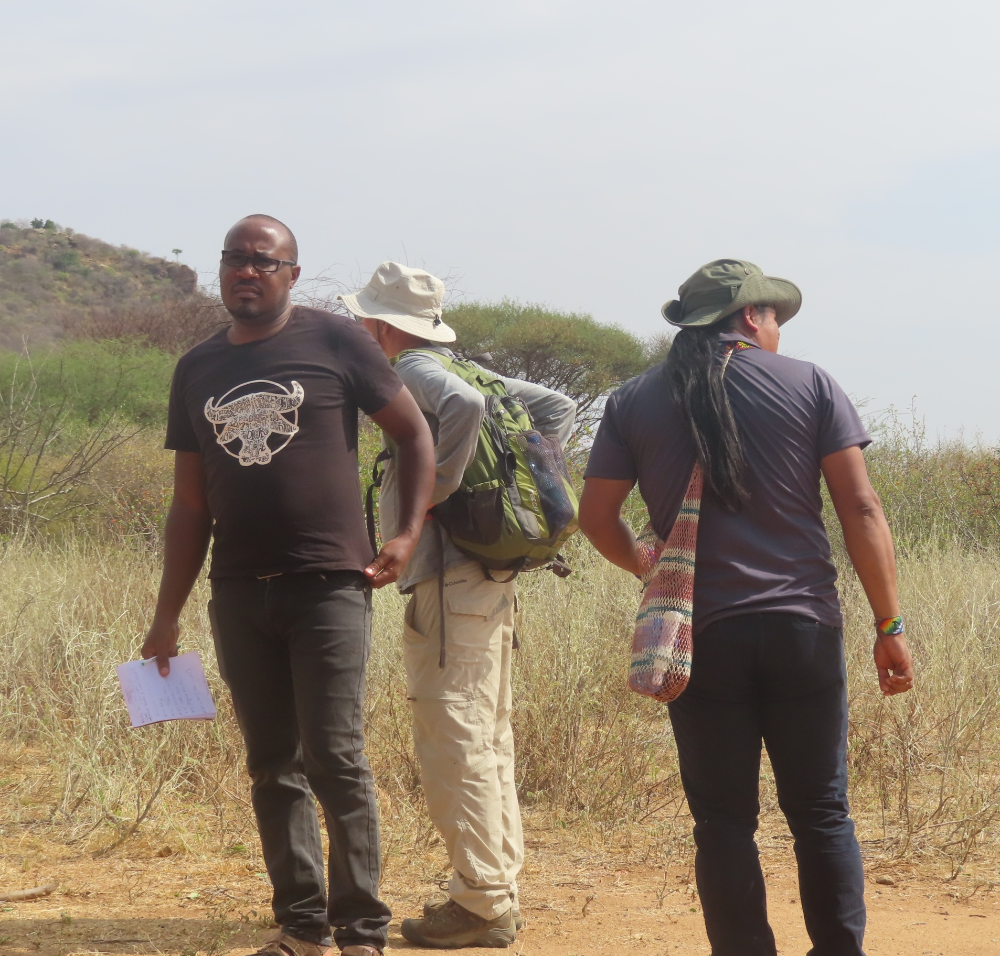

<!-- Custom inline style for better centering and layout -->

<!-- ✅ Navigation Menu -->

  <a href="/">Home</a>
  <a href="/about">About</a>

<!-- ✅ Hero Section -->

  
  <h1>👋🏽 Hello, I'm <strong>Douglas Mbura</strong></h1>
  

I am an <b> Environmental & Biosystems Engineer </b> specializing in Water, Sanitation, and Irrigation systems in Kenya - Currently advancing county-level infrastructure with the County Government of Nyamira. 

 Alongside my engineering work, I lead Indigenous-led initiatives in Bioacoustics, Machine Learning and AI with the Geo Indigenous Alliance. Over the past five years—since the COVID-19 pandemic—I have supported Indigenous communities across the world in harnessing Web GIS technologies to build digital tools, map and monitor their territories, address challenges such as human–wildlife conflict, strengthen climate resilience, and share their stories with the world.

My work has connected me with communities including the Quilombola and Suruí Paiter in Brazil; the Lakota community in the United States; the Shuar community in the Ecuadorian Amazon and the Samburu community in Northern Kenya, where I spent over a year conducting fieldwork in the Namunyak Conservancy. 

  

  <a href="/about" class="btn">Learn More About Me →</a>

---

## 💧 Current Projects

### **1️⃣ Nyamira Water Treatment Plants**
Construction of 5 treatment plants and a 177.2 km network serving 12,651 households.  
**Budget:** KES 750M (USD 6M)

### **2️⃣ UNCDF – Decentralized Wastewater Treatment Facilities (DTFs)**
Proposal to establish 8 DTFs across Nyamira County, supporting SDG 6 & 11.

### **3️⃣ Ltome–Katip Indigenous AI Project**
Indigenous-led bioacoustics research analyzing elephant and rat communication patterns using AudioMoths and AI tools.

---

## 🧠 Key Skills
- GIS, Remote Sensing & Mapping 
- Water Supply & Sanitation Engineering  
- Indigenous Data & AI Ethics  
- Bioacoustics & Machine Learning  
- Project Management & Implementation  

---

<h3>🧭 My Philosophy</h3>
<blockquote>“I am dedicated to building impactful solutions that address the needs of underserved communities. My work is grounded in user-centered and participatory design, ensuring that the people closest to the challenges play an active role in shaping the outcomes. I believe in simplicity and measurable results—creating solutions that are not only functional, but truly transformative.”</blockquote>

---

© {{ site.time | date: "%Y" }} Douglas Mbura · Built with ❤️ using <a href="https://pages.github.com/">GitHub Pages</a>

